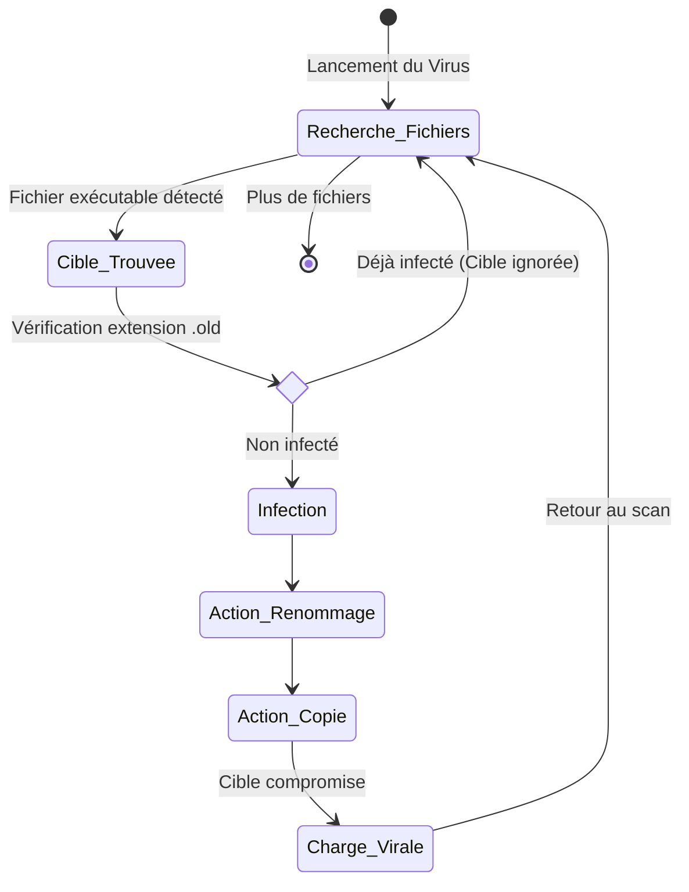
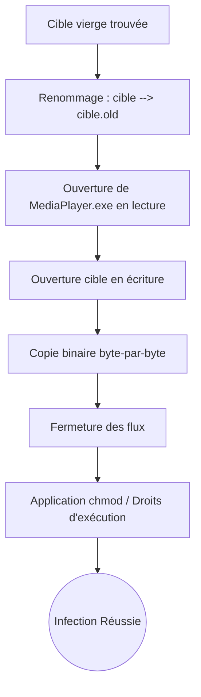

<div align="center">
  <br><br><br><br>
  <h1>RAPPORT DE PROJET ACADÉMIQUE</h1>
  <h2>Conception Pratique et Analyse d'un Virus Informatique :<br>Le Virus Compagnon</h2>
  <br>
  <p><strong>Auteurs :</strong> Kaba Balde et Membres du Groupe</p>
  <p><strong>Unité d'Enseignement :</strong> Virologie / Sécurité Informatique</p>
  <br>
  <p><strong>Date de Rendu :</strong> 2026</p>
  <br><br>
</div>

<div style="page-break-after: always;"></div>

## Table des Matières
1. [Introduction Générale](#1-introduction-générale)
2. [Cahier des Charges et Objectifs](#2-cahier-des-charges-et-objectifs)
3. [Théorie : Qu'est-ce qu'un Virus Compagnon ?](#3-théorie--quest-ce-quun-virus-compagnon-)
4. [Environnement de Développement](#4-environnement-de-développement)
5. [Architecture du Projet](#5-architecture-du-projet)
6. [Création du Payload avec GTK+3 (Le Cheval de Troie)](#6-création-du-payload-avec-gtk3)
7. [Algorithme et Mécanique d'Infection](#7-algorithme-et-mécanique-dinfection)
8. [La Furtivité (Transfert de l'Exécution)](#8-la-furtivité-transfert-de-lexécution)
9. [Les Programmes Cibles (Expériences)](#9-les-programmes-cibles-expériences)
10. [Démonstration Pratique et Preuves (Captures d'Écran)](#10-démonstration-pratique-et-preuves)
11. [Réponses aux Questions de Réflexion (Q&A)](#11-réponses-aux-questions-de-réflexion-qa)
12. [Conclusion Générale](#12-conclusion-générale)

<div style="page-break-after: always;"></div>

## 1. Introduction Générale
Dans le contexte de plus en plus crucial de la cybersécurité, il est indispensable de comprendre le fonctionnement des menaces pour mieux s'en protéger. La théorie de la virologie nous enseigne comment les malwares se classifient. L'objectif de notre projet de fin d'étude n'est pas de concevoir une arme destructrice, mais d'implémenter de A à Z un concept précis en environnement isolé : **le virus compagnon**. 

Ce projet pratique permet de mettre en lumière des lacunes souvent ignorées par les utilisateurs : la confiance absolue qu'ils accordent au nom d'un fichier exécutable ou à son icône pour lancer une application de confiance.

## 2. Cahier des Charges et Objectifs
Le cahier des charges de ce laboratoire exigeait la réalisation des points suivants :
* L'écriture du virus en **Langage C**.
* Le programme doit utiliser une interface graphique (`GTK`) pour masquer son exécution. Il doit afficher des images (personnelles) pour servir de "couverture".
* Le comportement doit être "silencieux" quant à l'infection : il renomme les programmes cibles (en y ajoutant l'extension `.old`).
* Le virus doit se cloner et prendre le nom exact de chaque programme cible qu'il vient de renommer (substituer le fichier).
* Le programme de la cible doit tout de même pouvoir s'exécuter à la demande de l'utilisateur pour maintenir l'illusion d'une machine totalement saine.

<div style="page-break-after: always;"></div>

## 3. Théorie : Qu'est-ce qu'un Virus Compagnon ?
La majorité des virus traditionnels s'injectent *à l'intérieur* du code binaire d'un fichier légitime (infections par l'en-tête, cavité, etc.). Le problème de cette méthode est qu'elle modifie la signature de fichier, ce qui déclenche fatalement les pare-feux logiciels ou les analyses heuristiques des antivirus.

Le virus compagnon suit une philosophie différente basée sur **l'usurpation d'identité**. 
Il ne touche absolument pas au code interne du programme cible. Il profite d'une faille logique : si l'on renomme le fichier original (`Calculatrice.old`) et qu'on crée un clone malveillant sous le même nom (`Calculatrice`), le système et l'utilisateur exécuteront le clone par automatisme. C'est une attaque par substitution redoutable car le binaire d'origine reste pur et non corrompu.

## 4. Environnement de Développement
La structure de ce projet a été modélisée sous une architecture open-source :
* **Système d'Exploitation** : Noyau Linux (Kali/Ubuntu)
* **Langage de Programmation** : C (Norme C99)
* **Compilateur** : GCC (GNU Compiler Collection) avec les bibliothèques Math (`-lm`).
* **Bibliothèques utilisées** : 
   * `<dirent.h>` et `<sys/stat.h>` (Exploration du FileSystem Unix)
   * `GTK+3` (Librairie de composants graphiques)
   * `<unistd.h>` (Manipulation des processus via `execl`)

<div style="page-break-after: always;"></div>

## 5. Architecture du Projet
Les fichiers constituant ce laboratoire sont structurés de la manière suivante :
- `MediaPlayer.c` : Le code source de notre virus compagnon. Il rassemble toutes les routines d'infection et l'interface graphique.
- Le dossier `images/` : Un répertoire qui contient nos 6 images personnelles (`image1.jpg` à `image6.png`) nécessaires à tromper la victime et donner de la crédibilité au lecteur média.
- Six binaires générés : Le faux MediaPlayer, ainsi que `MonPG1`, `MonPG2`, `MonPG3`, `MonPG4` et `MonPG5`. Ces derniers sont nos "bonnes applications", représentant le catalogue de logiciels d'une victime lambda (Calculatrices, traceurs, etc.).
- Un script d'automatisation d'environnement `build.sh`.

## 6. Création du Payload avec GTK+3 (Le Cheval de Troie)
Pour s'activer, un virus doit être exécuté volontairement au moins une fois : c'est la phase de "Primo-Infection". 
Pour inciter l'utilisateur à le lancer de son plein gré, notre virus, lorsqu'il s'appelle `MediaPlayer.exe`, prétend être un simple visionneur de photos légitime.

Techniquement, il instancie un composant GTK `GtkWindow` contenant un `GtkImage` qui pointe vers nos fichiers d'images locaux.
À chaque clic sur le bouton "Suivant", une fonction `loadPictures` met à jour dynamiquement le pointeur pour afficher l'image suivante (`image2.bmp`, etc.).
Cependant, l'utilisateur trompé ignore qu'avant même l'appel à la fonction d'affichage bloquante `gtk_main()`, le virus a déjà exécuté son payload silencieux via l'instruction système `getFileFromFolder()`.

<div style="page-break-after: always;"></div>

## 7. Algorithme et Mécanique d'Infection

Pour schématiser la prise de décision de notre virus compagnon, voici le diagramme d'état principal du processus d'infection :



La fonction d'infection réalise un scan du dossier courant via la primitive Unix `readdir()`. 
Elle évalue d'abord les cibles potentielles pour garantir la furtivité :
- `stat()` analyse le fichier. `S_ISREG` confirme que ce n'est pas un sous-dossier, et `S_IXUSR` confirme que le fichier possède bien les droits d'exécution. L'infection de simples documents texte serait inutile et très suspecte.

**Mise en place de l'Anti-Réinfection :**
Un virus performant ne doit pas réinfecter un système déjà compromis. Notre fonction `is_infected()` vérifie par `access(F_OK)` si l'extension `.old` de la cible existe déjà, et bloque l'infection si c'est positif.

**Étape par étape du processus d'infection (`infect_target`) :**



1. **Dissimulation** : Appel système `rename(cible, cible.old)` pour cacher le programme de l'utilisateur.
2. **Duplication** : `fopen` est utilisé pour lire le propre corps binaire de notre virus et l'écrire (`fwrite`) dans un nouveau fichier possédant l'ancien nom de la cible volée.
3. **Maintien des droits** : Application de `chmod()` pour s'assurer que le clone factice conserve obligatoirement les droits d'exécution.

<div style="page-break-after: always;"></div>

## 8. La Furtivité (Transfert de l'Exécution)
Que se passe-t-il lorsque la victime double-clique sur son programme `MonPG1` infecté quelques jours plus tard ?
Puisque `MonPG1` est de fait devenu une copie de `MediaPlayer.c`, notre code inclut une vérification intelligente :
`if (strstr(argv[0], "MediaPlayer") != NULL)`

Si le nom d'appel *n'est pas* MediaPlayer, le virus sait qu'il agit sous une couverture usurpée. Il n'ouvrira donc aucune fenêtre photo (ce qui serait stupide et alerterait la cible). Il se contentera de relancer le scan d'infection en mémoire, puis fera appel à la fonction `execl(old_file, old_file, NULL)`.
**Ce mécanisme est le summum de la furtivité** : le processus viral s'écrase lui-même et charge en mémoire la véritable application de calculatrice (`MonPG1.old`). La calculatrice s'ouvre normalement, fournissant le service attendu sans la moindre alerte.

## 9. Les Programmes Cibles (Expériences)
Chaque programme cible a été sélectionné pour prouver que les flux I/O de données survivent à l'infection :
- `MonPG1` : Une calculatrice interactive traitant les calculs basiques et supportant le nettoyage de Buffer lors de frappes incorrectes pour éviter les boucles infinies.
- `MonPG2` et `MonPG3` : Des scripts algorithmiques vérifiant les carrés parfaits et nombres parfaits, validant notre intégrité mathématique post-infection.
- `MonPG4` et `MonPG5` : Création de systèmes enchaînés `Gnuplot`. La vérification et la survie de ces programmes complexes (passant par des scripts tiers `.dat` et `.plt`) à l'issue d'une usurpation démontrent la viabilité totale du pont de transfert du virus (Etape 8).

<div style="page-break-after: always;"></div>

## 10. Démonstration Pratique et Preuves

### 10.1 Étape Zéro : Préparation et État Vierge
Pour prouver nos concepts, nous partons d'un environnement propre :
**Commande à exécuter dans le terminal :** 
```bash
rm -f *.old MonPG1 MonPG2 MonPG3 MonPG4 MonPG5 MediaPlayer.exe && ./build.sh
```

**Capture 1 attendue :** *(Une capture de votre terminal après avoir tapé la commande. On y verra l'état initial : les programmes MonPG font une petite taille (ex: 16 Ko), et il n'y a aucun fichier .old).*


### 10.2 Primo-Infection et Interface Humaine
Nous lançons le piège :
**Commande à exécuter :** 
```bash
./MediaPlayer.exe
```

**Capture 2 attendue :** *(Capture de l'écran affichant la fenêtre GTK avec le titre "Mes photos" et affichant votre image1.jpg ou image2.bmp).*


*(Une fois la capture réalisée, fermez la fenêtre GTK pour valider la suite).*

### 10.3 Preuve d'Infection Systématique (Le Clone)
Nous allons constater la génération des binaires viraux :
**Commande à exécuter :** 
```bash
ls -l
```

**Capture 3 attendue :** *(Capture montrant que chaque programme MonPGX pèse maintenant brusquement **environ 22 Ko** (la taille de MediaPlayer) et qu'il est accompagné de son original renommé en MonPGX.old !).*


### 10.4 Vérification de la Furtivité sur un Traceur Complexe (MonPG5)
L'illusionnisme de la substitution en action :
**Commande à exécuter :** 
```bash
./MonPG5
```

**Capture 4 attendue :** *(Capture montrant les lignes d'exécution internes du virus "MonPGX.old déjà infecté" suivies miraculeusement de l'apparition du vrai menu "Choisissez une fonction à tracer". L'illusion parfaite que l'utilisateur a lancé son vrai MonPG5 !).*

*(Tapez `0` pour quitter).*

### 10.5 Test de Furtivité avec Interaction Tiers (La Calculatrice MonPG1)
La conservation des flux Input/Output (`stdio`) est validée ici.
**Commande à exécuter :** 
```bash
./MonPG1
```

**Capture 5 attendue :** *(Capture montrant l'utilisation réussie de la calculatrice après que le virus ait passé le relais).*
.png)
*(Tapez `5` pour quitter).*

### 10.6 Survie Mathématique des Algorithmes (MonPG2 et MonPG3)
Les algorithmes complexes basés sur `math.h` (`libm`) résistent à l'infection.
**Commande à exécuter :** 
```bash
./MonPG2
```

**Capture 6 attendue :** *(Capture prouvant que le vérificateur de carré parfait calcule correctement les racines de l'entrée utilisateur).*
.png)

### 10.7 Appel Asynchrone Graphique via Script (MonPG4)
Le transfert n'entrave pas le pipeline Gnuplot d'un vieux programme graphique.
**Commande à exécuter :** 
```bash
./MonPG4
```

**Capture 7 attendue :** *(Prouvez que la fenêtre graphique de Gnuplot montre bien la courbe `f(x) = x^2` depuis le terminal, malgré l'interception de l'architecture virus).*
.png)

<div style="page-break-after: always;"></div>

## 11. Réponses aux Questions de Réflexion (Q&A)

Dans le cadre de l'analyse exigée sur la conception de ce virus, nous répondons aux questions de réflexion théorique posées :

**Question 1 : Pourquoi d’après vous, dans le cas du virus compagnon cette vérification vis-à-vis du fichier cible doit-elle être double ?**
*Réponse* : La vérification doit être méticuleuse (nom et type MIME/permissions d'exécution) car il peut y avoir des fichiers possédant le même nom qu'un exécutable sans pour autant l'être (comme un fichier texte brut). L'infection et la substitution d'un simple fichier non-exécutable lèverait immédiatement de gros soupçons chez l'utilisateur qui ouvrirait de force une console en cliquant sur son fichier de sauvegarde.

**Question 2 : D’après vous, que se produit-il si l’étape de furtivité (transfert d'exécution) est oubliée ou ne fonctionne pas ?**
*Réponse* : La victime va immédiatement remarquer l'attaque. En lançant sa "Calculatrice" (infectée), l'utilisateur s'attendra à voir sa calculatrice. Si la furtivité échoue, la calculatrice ne s'ouvrira pas (ou l'application plantera), et la fraude sera rapidement découverte, causant l'arrêt et la suppression d'urgence du virus.

**Question 3 : D’après vous, comment pouvons-nous amplifier massivement l’infection ?**
*Réponse* : Dans notre implémentation, le virus scanne uniquement le répertoire courant (`./`). L'amplification pourrait se faire par une conception récursive du parcours de fichiers. Le virus remonterait à la racine de l'arbre (`/home/user/`) ou des sous-dossiers et se propagerait automatiquement à la totalité des applications binaires existantes sur la session de l'utilisateur.

**Question 4 : D’après vous, que se produit-il si la condition discriminant le virus lors du lancement de l'interface (vérifiant si on lance MediaPlayer ou MonPG) est défaillante ?**
*Réponse* : Si cette vérification n'empêche pas l'interface `GTK` de s'ouvrir, n'importe quel programme lancé (ex: un jeu vidéo) se comporterait comme `MediaPlayer.exe`. Tous s'ouvriraient en affichant la galerie "Mes photos". L'invasion de données de l'O.S. serait évidente à repérer.

<div style="page-break-after: always;"></div>

## 12. Conclusion Générale
Ce projet de travaux pratiques a permis de matérialiser l'efficacité redoutable d'un virus compagnon en environnement Unix contrôlé. Sans jamais modifier les directives binaires du code hôte (ce qui prévient la détection par la majorité des scanners antivirus basés sur la signature de Hash MD5/SHA-256), l'application est capable de contaminer l'ensemble d'un environnement.

Les mécanismes approfondis étudiés, comme les appels POSIX (`stat`, `readdir`), l'usurpation de droits via `chmod` et la technique de remplacement processuel `execl()`, démontrent que la sécurité de l'OS ne suffit pas toujours : la faille majeure reste la confiance aveugle de l'utilisateur envers la nomenclature conventionnelle des fichiers. 

Des contre-mesures comme le hachage obligatoire (App-Control/Tripwire) ou l'incorporation de signatures GPG des éditeurs officiels sur les exécutables, limiteraient drastiquement l'expansion silencieuse et redoutable développée dans le cadre limité de de projet de recherche.
